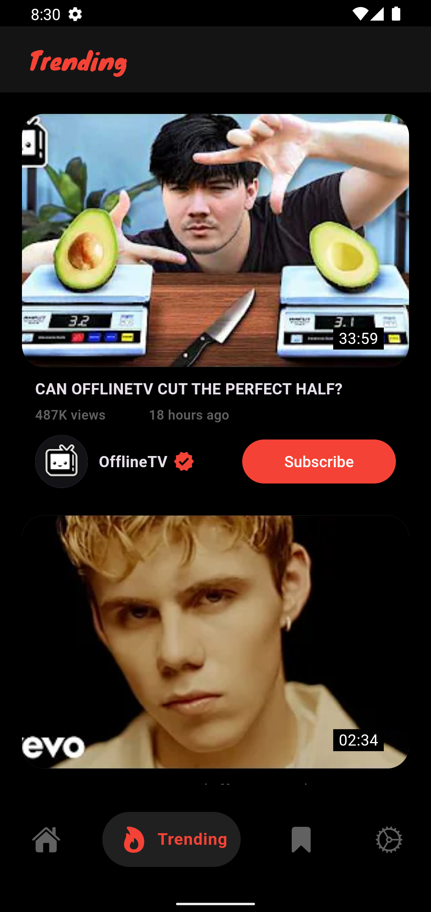
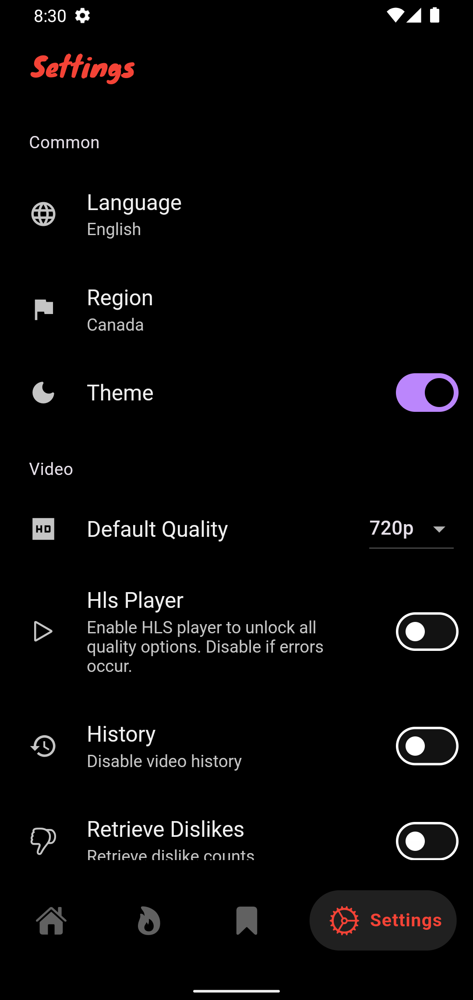

# FluxTube: YouTube Client App


<p align="center">
<a href="https://github.com/mu-fazil-vk/FluxTube/releases" alt="GitHub release"></a>
<a href="https://www.gnu.org/licenses/gpl-3.0.en.html" alt="GitHub release"></a>
  <a href="https://github.com/mu-fazil-vk/FluxTube/releases" alt="GitHub release"></a>
  <a href="https://github.com/mu-fazil-vk/FluxTube/releases" alt="GitHub release"></a>
  <a title="Crowdin" target="_blank" href="https://crowdin.com/project/fluxtube"></a>
</p>

A powerful and ad-free YouTube client built using Flutter. Watch YouTube videos without ads, subscribe to channels, retrieve video dislikes, read comments, save videos, and much more.

## Features

- **No Login Needed**: Use the app without any login requirements.
- **Ad-Free Experience**: Enjoy YouTube videos without interruptions.
- **Channel Subscriptions**: Subscribe to your favorite channels.
- **Dislike Retrieval**: See the number of dislikes on videos.
- **Comment Section**: Read the video comments.
- **Save Videos**: Save videos to watch later.
- **Select Your Region**: Customize the content based on your region.
- **Multi-Language Support**: Use the app in multiple languages.
- **Watch live streams**: Effortlessly enjoy live content.
- **Different Audio Selection Support**: Choose from different audio options.
- **Watch Videos up to 4K Quality**: Enjoy videos in high quality up to 4K resolution.

## Screenshots
<div align="center">
  
  
  
  
</div>

## Download

<a href='https://github.com/mu-fazil-vk/FluxTube/releases'></a><br>
<a href='https://apt.izzysoft.de/packages/com.fazilvk.fluxtube'></a><br>
You can download the latest version of the app from the [releases page](https://github.com/mu-fazil-vk/FluxTube/releases).

## Todo

- [ ] Playlist Support
- [x] Picture in Picture Mode
- [x] Channel Profile Support
- [x] Subtitle Support
- [x] Unlimited Scroll Support

## Translations
- Go to [Crowdin](https://crowdin.com/project/fluxtube/invite?h=4d7d9f6ba7c350dc176d6f75a5f569362170999) and help with the translations.

## Contribution

Contributions are welcome! Whether you have ideas, translations, design changes, code cleaning, or even major code changes, help is always welcome. The app gets better and better with each contribution, no matter how big or small!

If you have any ideas, suggestions, or issues, please open a [new issue](https://github.com/mu-fazil-vk/FluxTube/issues) or submit a pull request.

1. Fork the repository.
2. Create a new branch: `git checkout -b my-feature-branch`
3. Commit your changes: `git commit -m 'Add some feature'`
4. Push to the branch: `git push origin my-feature-branch`
5. Submit a pull request.

   #### Note:
   - Flutter version: `3.24.4`
   - Bulid runner command for Isar & Bloc: `flutter pub run build_runner build --delete-conflicting-outputs`
   - Translation command: `dart run intl_utils:generate`

## License

FluxTube is a free software licensed under GPL v3.0 

## Support:

<p><a href="https://www.buymeacoffee.com/fazilvk"> </a></p><br><br>
<br>


## Message Me

If you have any questions or need further assistance, feel free to contact me.
<p align="left">
<a href="https://t.me/fazilvk" target="blank"></a>   
<a href="https://instagram.com/fazil.v.k" target="blank"></a>
<a href="mailto:fazilvk6@gmail.com" target="blank"></a>


## Privacy Policy

The FluxTube project is designed to offer a private, anonymous YouTube experience. The app ensures no data is collected without your explicit consent. Your privacy is a top priority. Enjoy watching YouTube securely with FluxTube.

## Warning

```
This project was created for learning purposes and is not affiliated with any content provider. 
All videos, content, and trademarks are the property of their respective owners. 
FluxTube is not responsible for any copyright infringements. This software is provided "as-is" without 
any warranty, and the author is not liable for any damages arising from its use.

This project is not officially associated with YouTube. 
```
