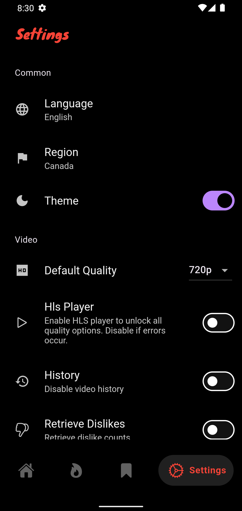

# FluxTube Indonesia: YouTube Client App


<p align="center">
<a href="https://github.com/mu-fazil-vk/FluxTube/releases" alt="GitHub release"></a>
<a href="https://www.gnu.org/licenses/gpl-3.0.en.html" alt="GitHub release"></a>
  <a href="https://github.com/mu-fazil-vk/FluxTube/releases" alt="GitHub release"></a>
  <a href="https://github.com/mu-fazil-vk/FluxTube/releases" alt="GitHub release"></a>
  <a title="Crowdin" target="_blank" href="https://crowdin.com/project/fluxtube"></a>
</p>

An ad-free YouTube client built with Flutter. Watch YouTube videos without ads, subscribe to channels, retrieve video dislikes, read comments, save videos, and more.

> **Note:** This app was originally created for personal use. If it's not for you, that's fine - just don't use it. I've seen comments calling this a "NewPipe clone." Sure, if that's how you see it. But FluxTube is built with Flutter, supports multiple YouTube services (NewPipe Extractor, Piped, Invidious, Explode), and the whole point of having multiple backends is to keep the app working - if one service goes down, switch to another. If you actually care about improving it, open an issue. No offense.

## Features

- **No Login Needed**: Use the app without any login requirements.
- **Ad-Free Experience**: Enjoy YouTube videos without interruptions.
- **Multiple YouTube Services**: Switch between NewPipe Extractor, Piped, Invidious, or Explode backends.
- **Download Videos**: Download videos and audio in multiple qualities with FFmpeg merging support.
- **Background Playback**: Continue listening with notification controls (play/pause/seek).
- **Picture-in-Picture**: System PiP mode - auto-enters when pressing home while playing.
- **SponsorBlock**: Auto-skip sponsored segments, intros, outros, and more.
- **Multiple Profiles**: Separate subscriptions, history, and saved videos per profile.
- **Channel Subscriptions**: Subscribe to your favorite channels.
- **Dislike Retrieval**: See the number of dislikes on videos.
- **Comment Section**: Read video comments and replies.
- **Save Videos**: Save videos to watch later with search and sorting.
- **Deep Linking**: Open YouTube links directly in FluxTube.
- **NewPipe-Compatible Backup**: Import/export data as NewPipe-compatible ZIP files.
- **Select Your Region**: Customize the content based on your region.
- **Multi-Language Support**: 12+ languages supported.
- **Watch live streams**: Enjoy live content.
- **Video Fit Modes**: Contain, cover, fill, fit-width, fit-height.
- **Customizable Skip Interval**: Double-tap to skip 5-60 seconds.
- **Watch Videos up to 4K Quality**: Enjoy videos in high quality up to 4K resolution.
- **Distraction-Free Mode**: Hide comments and related videos.

###### Note:

Some features are only available when using the NewPipe Extractor service.

## Screenshots

<div align="center">
  
  
  
  
</div>

## Download

<p>
  <a href="https://github.com/mu-fazil-vk/FluxTube/releases">
    
  </a>
</p>

<p>
  <a href="https://apt.izzysoft.de/packages/com.fazilvk.fluxtube">
    
  </a>
</p>

You can download the latest version of the app from the [releases page](https://github.com/mu-fazil-vk/FluxTube/releases).

## FluxTube vs NewPipe App

If you select "NewPipe Extractor" as your YouTube service in FluxTube, it uses the same [NewPipe Extractor](https://github.com/TeamNewPipe/NewPipeExtractor) library under the hood. So what's the difference?

|                             | FluxTube                                           | NewPipe App                   |
| --------------------------- | -------------------------------------------------- | ----------------------------- |
| **Framework**         | Flutter (cross-platform)                           | Native Android (Kotlin/Java)  |
| **Multiple Backends** | Yes (NewPipe Extractor, Piped, Invidious, Explode) | No (NewPipe Extractor only)   |
| **Fallback Options**  | Switch service if one breaks                       | Wait for app update           |
| **SponsorBlock**      | Built-in                                           | Requires fork (e.g., Tubular) |
| **Multiple Profiles** | Yes                                                | No                            |
| **Download**          | Yes (all services, with FFmpeg merging)            | Yes                           |
| **Background Play**   | Yes (with notification controls)                   | Yes                           |
| **System PiP**        | Yes (auto-enter on home press)                     | Yes                           |

**TL;DR:** FluxTube gives you options. If NewPipe Extractor stops working tomorrow, you can switch to Piped or Invidious and keep watching. NewPipe app is more feature-complete for downloading, but you're stuck with one backend. The UIs are different too.

## Recommended Settings

For the best experience:

| Use Case                                | YouTube Service    | Notes                                                 |
| --------------------------------------- | ------------------ | ----------------------------------------------------- |
| **Recommended**                   | NewPipe Extractor  | Direct extraction, most reliable, no instances needed |
| **When NewPipe Extractor breaks** | Piped or Invidious | Instance-based, switch if one goes down               |

> **Tip:** Click on  "Auto-Check Instances" in settings for automatic failover when an instance becomes unavailable.

## Todo

- [X] Playlist Support
- [X] Picture in Picture Mode
- [X] Channel Profile Support
- [X] Subtitle Support
- [X] Unlimited Scroll Support
- [X] User Profiles
- [X] SponsorBlock
- [X] NewPipe-Compatible Backup/Restore
- [X] Deep Linking / Share Intent
- [X] Search History
- [X] Download Videos (all services)
- [X] Background Playback with Notification Controls
- [X] Android System Picture-in-Picture
- [X] Save Downloads to Public Storage
- [X] Database Migration (Isar → Drift)

## Translations

- Go to [Crowdin](https://crowdin.com/project/fluxtube/invite?h=4d7d9f6ba7c350dc176d6f75a5f569362170999) and help with the translations.

## Contribution

Contributions are welcome! Whether you have ideas, translations, design changes, code cleaning, or even major code changes, help is always welcome. The app gets better and better with each contribution, no matter how big or small!

If you have any ideas, suggestions, or issues, please open a [new issue](https://github.com/mu-fazil-vk/FluxTube/issues) or submit a pull request.

1. Fork the repository.
2. Create a new branch: `git checkout -b my-feature-branch`
3. Commit your changes: `git commit -m 'Add some feature'`
4. Push to the branch: `git push origin my-feature-branch`
5. Submit a pull request.

   #### Note:


   - Flutter version: `3.24.4`
   - Bulid runner command for Isar & Bloc: `flutter pub run build_runner build --delete-conflicting-outputs`
   - Translation command: `dart run intl_utils:generate`

## License

FluxTube is a free software licensed under GPL v3.0

## Support:

<p><a href="https://www.buymeacoffee.com/fazilvk"> </a></p><br><br>
<br>

## Message Me

If you have any questions or need further assistance, feel free to contact me.

<p align="left">
<a href="https://t.me/fazilvk" target="blank"></a>   
<a href="https://instagram.com/fazil.v.k" target="blank"></a>
<a href="mailto:fazilvk6@gmail.com" target="blank"></a>

## Privacy Policy

The FluxTube project is designed to offer a private, anonymous YouTube experience. The app ensures no data is collected without your explicit consent. Your privacy is a top priority. Enjoy watching YouTube securely with FluxTube.

## Warning

```
This project was created for learning purposes and is not affiliated with any content provider. 
All videos, content, and trademarks are the property of their respective owners. 
FluxTube is not responsible for any copyright infringements. This software is provided "as-is" without 
any warranty, and the author is not liable for any damages arising from its use.

This project is not officially associated with YouTube. 
```
